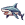
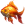
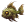
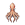
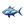

# Unity Fishing Game

This is a fishing game created in Unity.

## Play Instructions

Push the **Play Button** to start the game.

You are the fishing hook in the center of the screen. 

You will slowly descend towards the bottom of the screen. Push **Spacebar** or click the **Left Mouse** button, to pull the hook up. Avoid touching the ground. To catch a fish, collide with it. You will get or lose points and/or score modifiers depending on the fish you catch. You have **60** seconds to score as much as you can. A higher score multiplier increases the amount of points you gain or lose when catching a fish.

## Fishes

 Catching a shark ends the game.

 Catching a goldfish increases your score modifier.

 Catching a zombie fish decreases your score and score modifier.

 Catching an octopus increases your score modestly.

 Catching a BlueFin tuna increases your score greatly.

